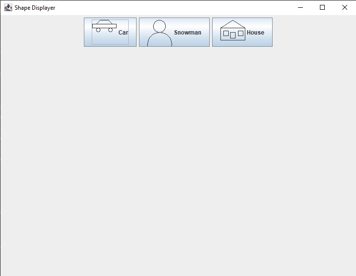
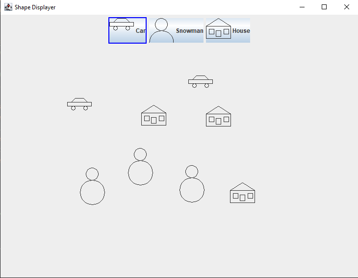

# ShapeDisplayer

A Java Swing GUI application that allows users to choose and draw different shapes (Car, Snowman, and Custom House) on a drawing panel. This project demonstrates object-oriented programming principles in Java, including the use of interfaces, custom shapes, and event handling with `ActionListener` and `MouseListener`.

## Features

- **Shape Selection**: Users can select one of three shapes (Car, Snowman, or House) by clicking the corresponding button. The selected button will be highlighted with a blue border.
- **Drawing Panel**: After selecting a shape, users can click on the drawing panel to add the shape at the clicked location. All previously drawn shapes remain on the panel.
- **Object-Oriented Design**: Each shape is implemented as a class that implements the `CompositeShape` interface, allowing for flexibility and reusability of shape objects.
  
## Technologies Used

- **Java**: Programming language used for the application.
- **Swing**: Java GUI toolkit used for creating the interface and handling events.
- **Graphics2D**: Used for drawing shapes on the panel.

## Classes and Files

- `ShapeDisplayer`: The main class that sets up the GUI with buttons and the drawing panel.
- `CompositeShape`: An interface that defines methods for drawing and moving shapes.
- `CarShape`, `SnowMan`, `HouseShape`: Concrete implementations of shapes that implement `CompositeShape`.
- `ShapeIcon`: A helper class that implements the `Icon` interface to display each shape as an icon on the buttons.

## Installation and Setup

1. Clone the repository:
   ```bash
   git clone https://github.com/your-username/ShapeDisplayer.git
   cd ShapeDisplayer

2. Compile the code:
   ```bash
   cd src
   javac *.java

3. Run the application
   ```bash
   java ShapeDisplayer

## Usage

1. Start the application by running the ShapeDisplayer class.
2. Click one of the shape buttons at the top (Car, Snowman, or House) to select a shape. The selected button will have a blue border to indicate it's active.
3. Click on the drawing panel to place the selected shape at the clicked location. Repeat to draw multiple shapes. Previously drawn shapes will remain on the panel.

## Example Screenshot



